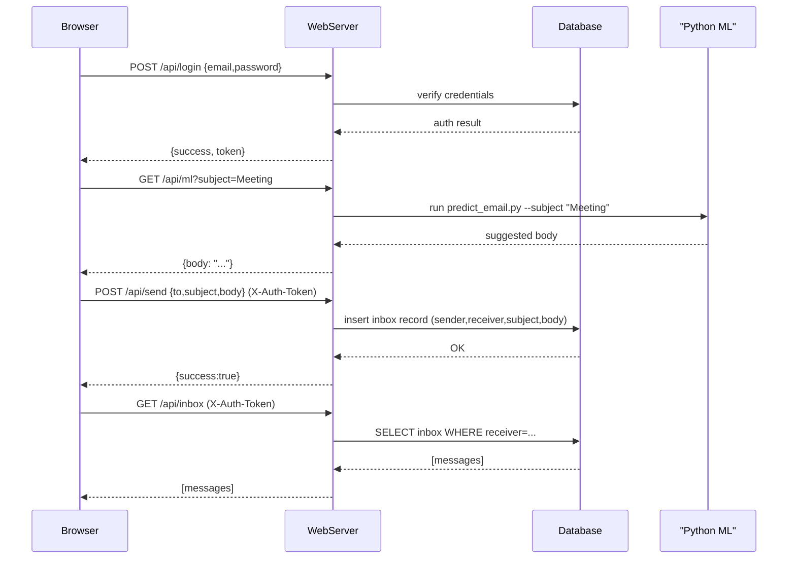

# SimpleEmailServer

A simple client–server email simulation implemented in Java with SQLite storage and an optional Python ML model to generate suggested email bodies from subjects.

## Architecture Overview

- Java server(s): TCP socket server (`EmailReceiverServer`) and HTTP server (`WebServer`) exposing REST endpoints and serving the web UI.
- SQLite database: stores users, inbox, and sent messages.
- Python ML: `ml_models/predict_email.py` suggests email bodies based on subject.
- Web UI: static SPA in `web/` to register/login, compose (with ML suggestion), and view inbox/sent.

## Sequence Diagram (high level)

The following Mermaid diagram shows the typical user flow when composing and sending an email using the web UI:

How to run 

1. Compile: `del *.class; javac -cp ".;lib/*" *.java`
2. Start the Web UI + API: `java -cp ".;lib/*" WebServer`
3. Open browser: `http://localhost:8080` to interact with the UI
